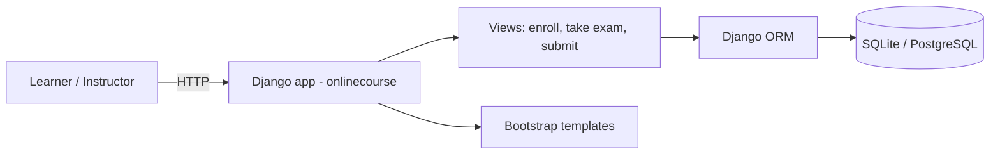

# Online Learning Platform — Django (course enrollment + assessments)

> **TL;DR** — A Django web application for online courses: instructors publish courses with lessons,
> learners enroll, and take **assessments** (exams with questions, choices and auto-grading). Built as
> the capstone of the IBM Full-Stack program and deployable to a cloud platform.
>
> **Stack:** Python · Django · SQLite (swappable for PostgreSQL/MySQL) · Bootstrap templates · Cloud
> Foundry (Procfile/manifest). **My role:** implemented the assessment feature (models, views, grading).

---

## What it does
- **Courses & content:** instructors, courses, lessons, and enrollments.
- **Assessments:** question bank with multiple choices, per-lesson exams, submission and **automatic
  scoring** with a results view.
- **Auth:** user registration/login using Django's auth system; learners have an occupation profile.

## Data model (core)
`Instructor` · `Learner` (occupation choices) · `Course` · `Lesson` · `Enrollment` · `Question` ·
`Choice` · `Submission` — the assessment feature links `Question`/`Choice` to lessons and records each
learner's `Submission` for grading.

## Architecture


## Run it locally
```bash
python -m venv .venv && source .venv/bin/activate
pip install -r requirements.txt
python manage.py migrate
python manage.py createsuperuser
python manage.py runserver     # http://localhost:8000
```

## Deployment
Ships with `Procfile`, `manifest.yml` and `runtime.txt` for IBM Cloud Foundry; any Django-supported host
and SQL database work.

## Notes
Capstone project of the IBM Full-Stack Software Developer certificate; the base `onlinecourse` scaffold
was provided and the **assessment feature** (questions, choices, submission, grading) was implemented on top.
