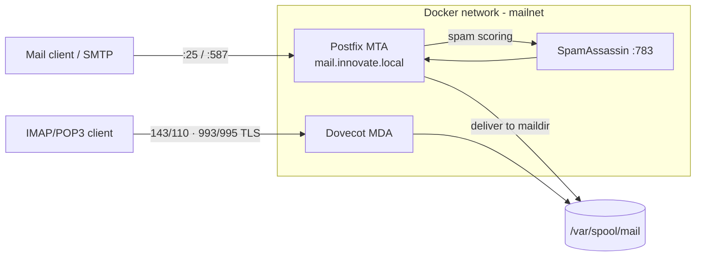

# Self-Hosted Email Stack with Docker

> **TL;DR** — A working self-hosted email system built with Docker Compose: **Postfix** (send/receive),
> **Dovecot** (mailbox access via IMAP/POP3) and **SpamAssassin** (spam filtering) on a private network.
> Built for a telematics course to design, deploy and test the full SMTP → filter → mailbox path.
>
> **Stack:** Docker Compose · Postfix (MTA) · Dovecot (MDA) · SpamAssassin · Alpine.

---

## 1. What it does
Runs a complete mail server locally under the `innovate.local` domain: Postfix accepts and routes mail,
passes it through SpamAssassin for scoring, and Dovecot serves it to clients over IMAP/POP3 (and their
TLS variants). Everything is containerized and wired on a single Docker network.

## 2. Architecture



| Service | Role | Ports |
|---|---|---|
| Postfix | MTA — send/receive & route mail | 25 (SMTP), 587 (submission) |
| SpamAssassin | Spam scoring daemon (`spamd`) | 783 |
| Dovecot | MDA — mailbox access | 143/110 (IMAP/POP3), 993/995 (TLS) |

## 3. Run it
```bash
docker compose up --build -d
docker compose ps        # verify postfix, dovecot, spamassassin are up
# test SMTP on :25 / submission :587, then read via IMAP :143 / POP3 :110
```
Configuration lives in each service folder: `postfix/config/main.cf`, `dovecot/config/…`,
`spamassassin/config/local.cf`.

## 4. Security note
TLS certificates/keys and the Dovecot `passwd` file are **not** committed — generate them locally
(they are git-ignored). For any real deployment, use strong per-user credentials and real certificates,
never the demo values.

## 5. Design notes & next steps
- Add DKIM/SPF/DMARC (OpenDKIM) for deliverability and anti-spoofing.
- Add a webmail UI (Roundcube) and healthchecks/restart policies to the compose file.
- Externalize secrets via a `.env` file and Docker secrets.
