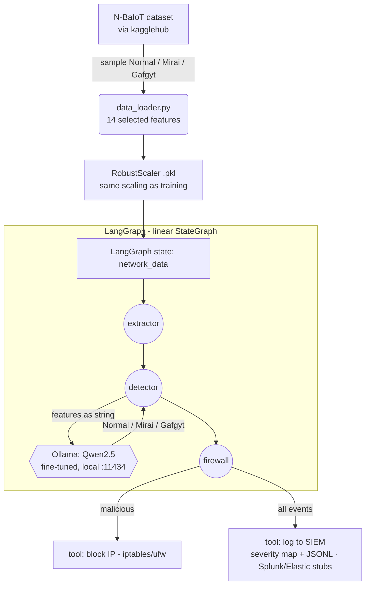

# Botnet Detection with LangGraph + a fine-tuned SLM

> **TL;DR** — A LangGraph pipeline that detects IoT botnet traffic (Mirai / Gafgyt) by having a
> **fine-tuned Small Language Model** reason directly over scaled network features, then trigger
> autonomous defensive actions (firewall block + SIEM logging). This is the **public, streamlined
> implementation** of my broader edge-AI thesis (see *Research context* below).
>
> **Stack:** LangGraph · Qwen2.5 (GGUF via Ollama) · scikit-learn (RobustScaler) · Python.
> **My role:** end-to-end — feature pipeline, fine-tuning, graph orchestration, response tools.

---

## 1. The problem
IoT devices get recruited into botnets. Detection should run locally (no cloud round-trip) and both
**classify** the flow and **respond** to it. Instead of a classic ML classifier, a fine-tuned SLM reads
the numeric features formatted exactly as during training, which lets one model classify *and* slot into
an agentic tool-use graph.

## 2. Architecture (this repo)



The graph is a linear `StateGraph` (`extractor → detector → firewall`) sharing a typed `BotnetState`
(`network_data`, `source_ip`, `prediction`, `security_action`, `actions_log`). A `Modelfile` frames the
Ollama prompt to always end with `Traffic:`, forcing an immediate, parseable label.

## 3. Autonomous response (SOC integration)
`src/tools/firewall_actions.py` maps threat → severity (`Mirai/Gafgyt → HIGH`, `Normal → INFO`), writes
structured JSONL, and ships `iptables`/`ufw` and **Splunk HEC / Elastic** stubs for a real deployment.

## 4. Repository layout
```
evaluate.py     # main entry: runs the graph on real N-BaIoT samples, prints confusion matrix + report
main.py         # minimal smoke test with two synthetic vectors (Normal / Mirai)
modelos_entrenados/   # Modelfile + robust_scaler.pkl (the fine-tuned .gguf is built locally, not tracked)
notebooks/      # LoRA / QLoRA fine-tuning + GGUF export for Ollama + feature engineering
src/graph/      # state.py · nodes.py · workflow.py (compiled graph)
src/models/     # model_loader.py (connects to local Ollama)
src/tools/      # firewall_actions.py (block + SIEM)
src/utils/      # data_loader.py (ETL + 14-feature selection + scaling)
```

## 5. Setup
```bash
python -m venv .venv && source .venv/bin/activate
pip install -r requirements.txt
ollama create qwen-botnet -f modelos_entrenados/Modelfile   # build the model from the Modelfile
python evaluate.py                                          # run on real N-BaIoT samples
```

## 6. Research context (the full thesis — private)
This repo is a clean, minimal version. My undergraduate thesis extends it into a **multi-agent** system
for **autonomous botnet mitigation on the edge** (NVIDIA Jetson Orin Nano, 7–15 W):
- **Classifier Agent** (BENIGN/SUSPICIOUS/MALICIOUS) → **Analyst Agent** (identifies the family, searches
  a vector memory) → **Edge Execution** + **Continuous Learning** (stores unseen patterns for zero-day
  recognition — no retraining).
- A single **Llama-3.2-1B** kept in memory (FP16) with **hot-swappable LoRA adapters** via PEFT.
- **46 features** selected from N-BaIoT's 115 (Spearman + a 7-method voting panel) over a balanced
  ~1.44M-record set (Benign / Mirai / BASHLITE).
- **Result: F1-macro 0.998** at **~93.8 ms/flow** on-device, traced/evaluated with LangSmith.

## 7. Design notes & next steps
Replace the synthetic input with a live source (MQTT/Kafka or a sniffer) and wire the Splunk/Elastic
stubs to a real SIEM; add per-class latency benchmarking.
