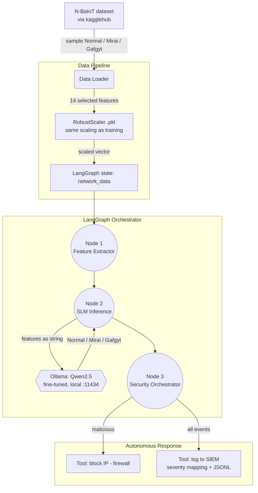

# Botnet Detection on the Edge — LangGraph + fine-tuned SLM

> **TL;DR** — An agentic cybersecurity pipeline that detects IoT botnet traffic (Mirai, Gafgyt) on
> resource-constrained edge hardware. Instead of a classic ML classifier, a **fine-tuned Small Language
> Model** reasons directly over scaled network features, orchestrated by **LangGraph**, and triggers
> autonomous defensive actions (firewall block + SIEM alert). Reached **F1-macro 0.998** on a balanced
> N-BaIoT sample (~1.44M records).
>
> **Stack:** LangGraph · Qwen2.5 (GGUF via Ollama) · LoRA/QLoRA fine-tuning · scikit-learn (RobustScaler)
> · Python. **My role:** end-to-end — feature pipeline, fine-tuning, graph orchestration, response tools.

---

## 1. The problem
IoT devices are frequently recruited into botnets. Detection must run **on the edge** (7–15 W devices,
e.g. NVIDIA Jetson) where heavy models don't fit. The goal: classify network flows and respond
autonomously, with near-perfect accuracy and low inference cost — without a cloud round-trip.

## 2. Why an SLM instead of Random Forest / SVM
A fine-tuned SLM reasons over the numeric features formatted exactly as during training, which lets the
same model both classify **and** slot into an agentic tool-use workflow. Determinism is enforced by a
`Modelfile` that frames the prompt to always end with `Traffic:`, forcing an immediate, parseable label.

## 3. Architecture



The graph is a linear `StateGraph` (`extractor → detector → firewall`) sharing a typed `BotnetState`
(`network_data`, `source_ip`, `prediction`, `security_action`, `actions_log`).

## 4. Response tools (SOC integration)
`src/tools/firewall_actions.py` simulates perimeter defense and produces SIEM-ready events: it maps
threat type → severity (`Mirai/Gafgyt → HIGH`, `Unknown → MEDIUM`, `Normal → INFO`), writes structured
JSONL, and ships stubs for **Splunk HEC** and **Elastic SIEM** for a production deployment.

## 5. Repository layout
```
evaluate.py            # main entry: assembles the graph, runs on real data, prints confusion matrix
main.py                # minimal smoke test with two synthetic vectors (Normal / Mirai)
modelos_entrenados/    # Modelfile + robust_scaler.pkl (the fine-tuned .gguf is built locally, not tracked)
notebooks/             # LoRA / QLoRA fine-tuning + GGUF export for Ollama + feature engineering
src/graph/             # state.py (shared memory) · nodes.py (logic) · workflow.py (compiled graph)
src/models/            # model_loader.py (connects to local Ollama)
src/tools/             # firewall_actions.py (block + SIEM)
src/utils/             # data_loader.py (ETL, 14-feature selection + scaling)
```

## 6. Results
- **F1-macro 0.998** on a balanced N-BaIoT sample (~1.44M records).
- **~93.8 ms** inference per flow on edge-class hardware (7–15 W envelope).
- Fully local inference (no cloud), suitable for continuous on-device monitoring.

## 7. Setup
```bash
python -m venv .venv && source .venv/bin/activate
pip install -r requirements.txt
# 1) Install Ollama and create the model from modelos_entrenados/Modelfile
ollama create qwen-botnet -f modelos_entrenados/Modelfile
# 2) Run the full pipeline on real samples
python evaluate.py
```

## 8. Design notes & next steps
- Replace the synthetic edges with a real ingestion source (MQTT/Kafka or a packet sniffer) feeding
  `network_data`.
- Add automatic recovery/re-evaluation on repeated alerts and a feedback loop that stores confirmed
  detections in a vector store for continuous learning.
- Wire the Splunk/Elastic stubs to a live SIEM and add per-class latency benchmarking.
