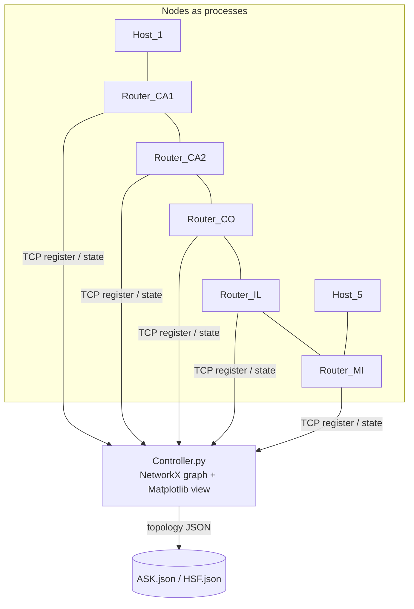

# NSFNET Topology — Socket-Based Distributed Routing Simulation

> **TL;DR** — A from-scratch simulation of the **NSFNET** backbone where each router and host is an
> independent Python process communicating over **TCP sockets**. A central controller discovers the
> topology, builds a graph with NetworkX, and visualizes it — a hands-on way to study distributed
> routing without specialized hardware.
>
> **Stack:** Python · sockets + threading · NetworkX · Matplotlib. **Domain:** computer networks / telecom.

---

## What it solves
Understanding routing usually means abstract diagrams. This project makes it concrete: it models the
US NSFNET backbone as real communicating processes (one per node), so you can watch nodes register,
links form, and paths get computed across an actual message-passing system.

## Architecture


- **`Node.py` / `Link.py`** — data structures for routers/hosts and links (id, name, IP, port, type).
- **`Router_*.py` / `Host_*.py`** — one process per NSFNET node, connecting over sockets.
- **`Controler.py`** — synchronizes via a lock, collects node/link state, builds the NetworkX graph,
  persists topology to JSON, and renders it with Matplotlib.

## Run it
```bash
python -m venv .venv && source .venv/bin/activate
pip install networkx matplotlib
python Controler.py          # start the controller
python Router_CA1.py         # start each node in its own terminal (Router_*, Host_*)
```

## Context & next steps
Earlier networking coursework and a companion to the SDN project
([Ryu_Controller_v1](https://github.com/YeisonDelgado/Ryu_Controller_v1)). Natural extensions: implement
Dijkstra/shortest-path over the collected graph, add link-failure events, and a small dashboard for the
live topology.
