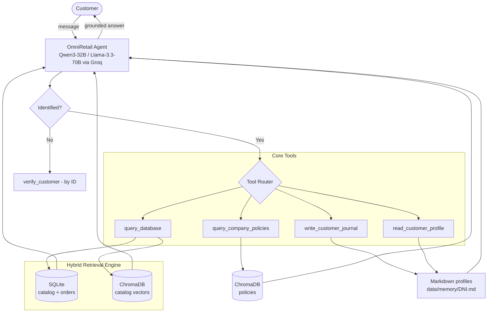

# OmniRetail — Autonomous AI Customer-Support Agent

> **TL;DR** — An AI customer-support agent for e-commerce that answers product, policy and order
> questions **without making things up**. The hard problem is trust, so I combined lexical + semantic
> retrieval with a strict rule — *a hard fact from the database beats a fuzzy document match* — plus
> memory compaction to keep context cost under control. Result: hallucinations driven to ~zero on
> tracked metrics.
>
> **Stack:** Strands Agents SDK · Groq (Llama 3.3 70B / Qwen3 32B) · SQLite · ChromaDB · SentenceTransformers
> **My role:** end-to-end design & build — retrieval engine, memory, anti-hallucination rules, telemetry.

---

## 1. The problem
Retail support agents fail in two expensive ways: they **invent** prices/specs (hallucination), and they
**forget** who the customer is across sessions. OmniRetail solves both:

- **Fuzzy catalog queries** → find the right product by combining keywords + semantic search.
- **Truthfulness** → the product database always wins over general policy text; never invent prices.
- **Real memory** → remember each customer's history/preferences across sessions while keeping the
  context window (and token cost) small.
- **Corporate policies** → answer warranty/returns/shipping strictly from official documents via RAG.

## 2. Architecture



**Tech stack**

| Layer | Technology | Purpose |
|---|---|---|
| Agent framework | `strands-agents` | Conversational loop, tool-calling, streaming |
| Reasoning LLM | `qwen3-32b` / `llama-3.3-70b` (Groq) | Native function calling |
| Compression SLM | `llama-3.1-8b-instant` | Summarizes history to save context |
| Relational store | SQLite | Customers, orders, lexical `LIKE` search |
| Vector store | ChromaDB | Policy RAG + semantic catalog search |
| Embeddings | `all-MiniLM-L6-v2` (SentenceTransformers) | Local vector generation |

## 3. Memory & context management
- **Short-Term Memory (STM) with compression:** after `TURN_LIMIT = 3`, an SLM (`temperature=0.1`)
  produces a dense technical summary; the history is compacted, keeping only the summary + last 2 turns.
- **Long-Term Memory (LTM):** per-customer Markdown profiles (`data/memory/{id}.md`) written/read via
  tools — durable preferences concatenated into the context on demand (no vector lookup needed).

## 4. Hybrid retrieval pipeline (A → B → C)
The `_search_product` function minimizes false positives with a multi-stage pipeline:

1. **A · Lexical (SQL `LIKE`)** — deterministic queries like *"iPhone 15"* match faster and cheaper by
   keyword than by cosine similarity, and consume no embedding tokens.
2. **B · Semantic (ChromaDB fallback)** — if lexical returns nothing, query vectors with hard metadata
   filters (e.g. `$lte` for a strict budget).
3. **C · Relevance + Category Grounding** — reject results above a distance threshold
   (`DISTANCE_THRESHOLD = 1.8`), then apply a keyword→category map so a semantically-close item from the
   wrong category (e.g. a phone *case* when asking for a *phone*) is filtered out.

## 5. Anti-hallucination rules (system prompt)
The agent enforces strict business rules; the key one is the **truth hierarchy**:

> **Priority:** `Product spec (SQLite) > General policy (RAG)`
> If policy says "all furniture requires home installation" but the product record says
> `INSTALLATION REQUIRED: No`, the agent answers **"No installation required"** — tabular evidence
> overrides a general rule. Prices/specs can never be altered to fit a budget; prompt-injection
> ("ignore previous instructions") is refused.

## 5.1 Five-branch routing gate
Before any tool runs, every request must fall into one of five branches, which decides whether identity
verification is required — this is what prevents private-data leaks:

| Branch | Intent | Action |
|---|---|---|
| 1 | General FAQ (sales channels, stores) | Policy RAG · no ID |
| 2 | Return/warranty policy | Policy RAG · no ID |
| 3 | Public catalog (stock, specs) | Product DB · no ID |
| 4 | Sensitive financials (taxes, invoice values) | **Blocked until ID/phone verification** |
| 5 | Order management / PII (shipments, history, tracking) | **Blocked until ID/phone verification** |

## 5.2 Stateless per-customer identity isolation
Security is atomic and preventive: when the loop detects a different customer ID, it destroys the
previous agent thread and re-instantiates a blank one via `FileSessionManager`, with each customer in an
isolated `sessions/session_<ID>/` directory — mathematically preventing cross-contamination between
customers. An output guardrail in `main.py` catches any response that references a name/ID other than the
validated customer and forces the model to self-correct before the UI ever sees it.

## 6. Telemetry
Every turn prints latency broken down by source — SQLite time, ChromaDB time, other tool I/O, and pure
model "thought time" (Groq) — so bottlenecks (local retrieval vs. remote inference) are visible live.

## 7. Setup
```bash
python -m venv venv && source venv/bin/activate   # Windows: .\venv\Scripts\activate
pip install -r requirements.txt
echo "GROQ_API_KEY=your_key_here" > .env
python main.py   # first run builds omniretail.db and indexes from /data automatically
```
Mock customer IDs for testing live in the seeded DB/CSVs under `/data`.

## 8. Design notes & next steps
- Add **hybrid scoring with Reciprocal Rank Fusion** to merge lexical + semantic results instead of
  fallback-only, and a **cross-encoder re-ranker** on the top-k.
- Add an **evaluation harness** (golden Q&A + hallucination checks) as a CI gate before releases.
- Move Markdown LTM to a small vector store once profiles grow, keeping the compaction strategy.
