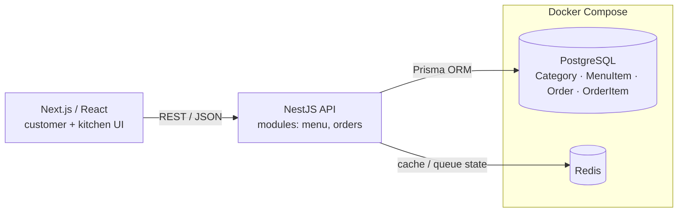

# Restaurant Management System — Full-Stack (NestJS + Next.js)

> **TL;DR** — A full-stack restaurant ordering and kitchen-queue system: customers/staff create orders,
> the kitchen tracks them through a status lifecycle, and everything runs on a typed backend with a
> relational schema, caching, and Docker. Built to practice production-grade full-stack architecture.
>
> **Stack:** NestJS (TypeScript) · Prisma · PostgreSQL · Redis · Next.js/React · Docker Compose.

---

## 1. What it does
- Manage a **menu** (categories → items with price, availability, image).
- Create and track **orders** through a lifecycle: `PENDING → IN_PROGRESS → READY → COMPLETED` (or
  `CANCELLED`), each with a unique queue number, table, ETA and total.
- Back-office/kitchen view of the live queue backed by a REST API.

## 2. Architecture



**Data model (Prisma):** `Category 1—* MenuItem`, `Order 1—* OrderItem *—1 MenuItem`, with an
`OrderStatus` enum driving the kitchen workflow.

## 3. Tech stack
| Layer | Technology |
|---|---|
| Backend | NestJS (TypeScript), modular architecture (`menu`, `orders`) |
| ORM / DB | Prisma + PostgreSQL (UUID keys, migrations, seed) |
| Cache | Redis |
| Frontend | Next.js + React |
| Infra | Docker Compose (Postgres + Redis) |

## 4. Run it
```bash
# 1) Infra
cp .env.example .env            # set POSTGRES_PASSWORD and DATABASE_URL
docker compose up -d            # Postgres + Redis

# 2) Backend
cd restaurant_system/backend
npm install
npx prisma migrate dev && npx prisma db seed
npm run start:dev               # NestJS API

# 3) Frontend
cd ../frontend && npm install && npm run dev
```

## 5. Project layout
```
docker-compose.yml              # Postgres + Redis
restaurant_system/
  backend/    # NestJS: src/menu, src/orders, prisma/schema.prisma + migrations + seed
  frontend/   # Next.js / React app
```

## 6. Design notes & next steps
- Add **WebSocket/SSE** push so the kitchen queue updates in real time instead of polling.
- Use Redis as a **Bull queue** for order events and add integration tests around the status lifecycle.
- Add authentication/roles (customer vs. kitchen vs. admin) and request validation via DTOs + Zod.
