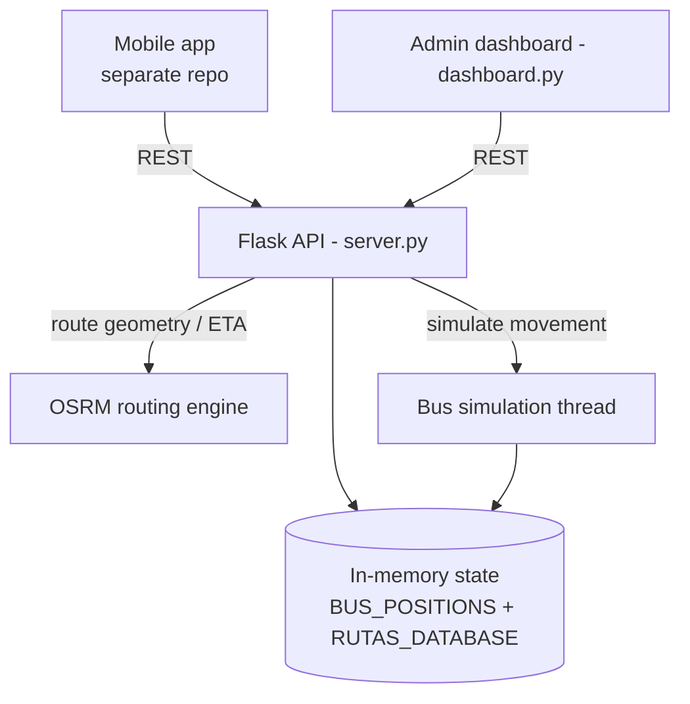

# RutaYA — Public-Transport Routing & Live Tracking (Popayán)

> **TL;DR** — Backend + admin dashboard for a public-transport mobile app in Popayán. It estimates a
> trip (time, distance, fare) between two points, tracks buses in real time, and can simulate bus
> movement for integration testing. The mobile app (separate repo) consumes this REST API.
>
> **Stack:** Python · Flask · Flask-CORS · OSRM (routing) · in-memory live state. **Domain:** mobility.

---

## 1. What it solves
Riders need to know *which bus, how long, and how much* before they travel. RutaYA exposes a routing +
tracking API over the city's routes and companies (e.g. TransPubenza, TransLibertad), plus a dashboard
to visualize buses live and simulate movement while the mobile app is developed.

## 2. Architecture



## 3. Core features
- **Route estimation:** distance/time/fare between two stops using OSRM + a fare model.
- **Live tracking:** `BUS_POSITIONS` keeps `{bus_id: {company, route, lat, lon, speed, timestamp}}`.
- **Route database:** stops per company/route with coordinates and order (Popayán geodata).
- **Simulation:** a background thread moves buses along their stops for end-to-end testing.

## 4. Run it
```bash
python -m venv .venv && source .venv/bin/activate
pip install -r requirements.txt
python server.py       # REST API (Flask)
python dashboard.py    # live map + simulation controls
```

## 5. Project layout
```
server.py          # Flask REST API: routing, fares, real-time bus positions
dashboard.py       # admin dashboard: live map + bus movement simulation
test_osrm.py       # OSRM integration checks
simple_test.py     # smoke tests · test_payload.json (sample request)
arquitectura.jpeg  # architecture diagram · casos_de_uso.png (use cases)
```

## 6. Design notes & next steps
- Move live state from in-memory to **Redis** (pub/sub) so multiple workers share bus positions.
- Persist routes/stops in PostgreSQL/PostGIS and expose GTFS-compatible endpoints.
- Add WebSockets for push tracking and unit tests around the fare/ETA logic.
