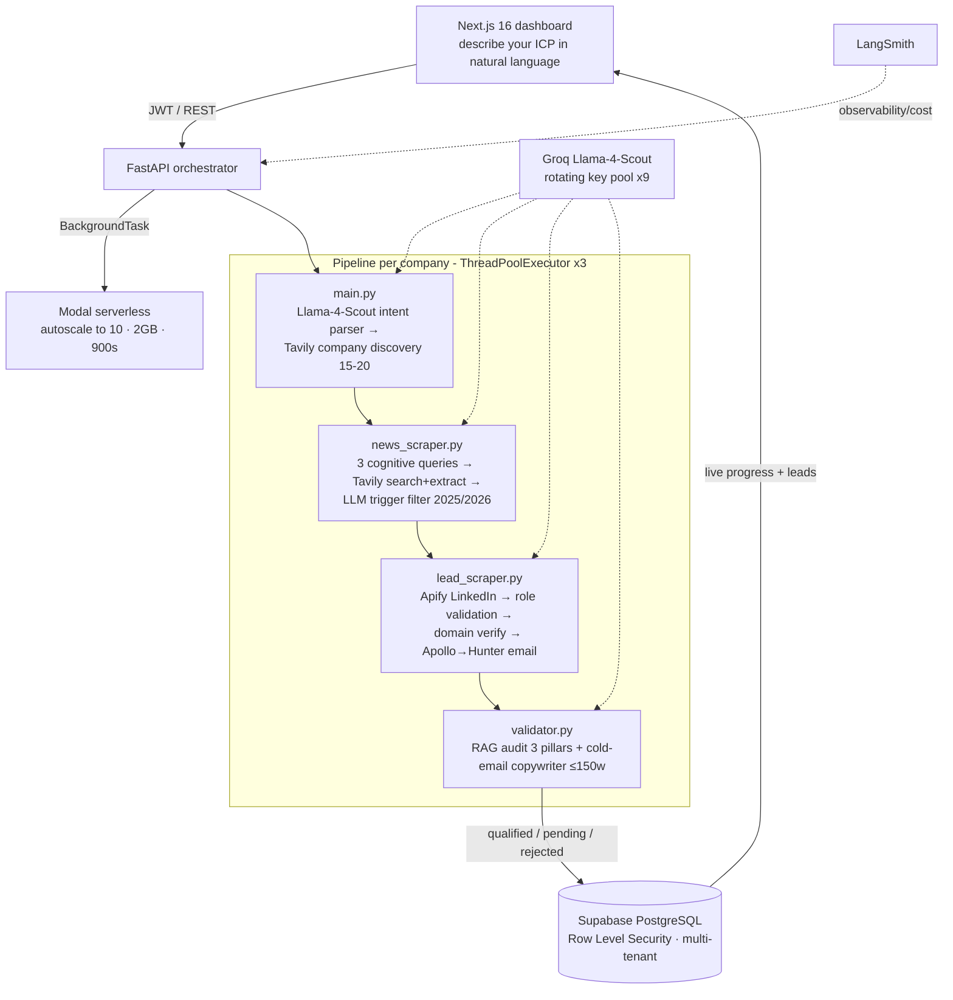

# Glovar Prospector — Case Study (autonomous B2B prospecting platform)

> **Code is private (built under employment / NDA).** This documents the real architecture, decisions
> and results so the engineering is visible without exposing proprietary code.
> Role: **AI Engineer** · Domain: logistics & life-sciences B2B · Status: shipped to production.

---

## TL;DR
A B2B sales team spent hours a day finding the right companies, researching a *reason to reach out*,
locating the decision-maker, finding a valid email, and writing a personalized first message. I built an
**autonomous multi-agent prospecting platform** that does all of it and returns qualified, scored leads
with a ready-to-send cold email — while keeping each client's data fully isolated (multi-tenant RLS).

## The problem (business terms)
Manual prospecting doesn't scale and burns money: inconsistent research, wrong contacts, bounced emails,
and generic outreach. The system had to produce **trustworthy** leads (real decision-maker, valid email,
a genuine 2025/2026 trigger) — not a scraped list that bounces.

## Architecture

## How it works (the hard parts)
1. **Intent understanding, not keyword matching.** A pre-flight LLM pass turns a free-text "ideal
   customer" description into a structured manifest (search tokens, normalized industry, buying trigger,
   a rigorous *pain framework*, target region). Everything downstream keys off this.
2. **Trigger-based relevance.** `news_scraper` runs three angled queries (expansion / regulatory-pain /
   market) and an LLM scores whether a real 2025-2026 event justifies outreach — no trigger, no spam.
3. **Deterministic firewall before paid APIs.** `lead_scraper` validates each LinkedIn profile in pure
   Python (is-this-a-real-human-role, company mismatch) *before* spending Apollo/Hunter credits, then
   **verifies the domain actually belongs to the company** (kills bounce-prone data-broker domains).
   Email enrichment cascades **Apollo → Hunter (verified) → pattern (flagged "inferred")**; no trusted
   domain ⇒ no email (rather than a bouncing guess).
4. **RAG audit + copywriting.** `validator` cross-checks each lead on three pillars (real trigger →
   operational impact → role fit); qualified leads get a ≤150-word personalized cold email; disqualified
   ones short-circuit to the DB in milliseconds without an LLM call.
5. **ICP scoring (fit + intent).** Leads are scored 0-100 and tiered A/B/C/D so the best surface first;
   high-fit-no-trigger stays as *nurture* instead of being discarded.

## Reliability & multi-tenant engineering
- **Per-job isolation:** every run writes artifacts under `.tmp/job_{job_id}/` so concurrent runs can't
  cross-contaminate ICPs (a real bug I fixed at the root).
- **Multi-tenant security:** Supabase **Row Level Security** validates the session JWT against `user_id`
  on every table — 100% data isolation between clients.
- **Concurrency without throttling:** deterministic **rotating pool of 9 Groq keys** (hashed by company)
  + strict pacing to respect rate limits; `ThreadPoolExecutor` processes 3 companies in parallel.
- **Idempotency:** re-runs skip companies already persisted for a `job_id`, avoiding wasted API credits.
- **Observability:** LangSmith traces latency and token cost; live job progress is piped to the dashboard.

## Stack
Python · FastAPI · **Modal** (serverless autoscaling) · **Supabase/PostgreSQL (RLS)** · **Groq
Llama-4-Scout** (key rotation) · Tavily (search/extract) · Apify (LinkedIn) · Apollo + Hunter.io (email)
· LangSmith · Next.js 16 / React 19 frontend. Two modes: **Fast** (contacts in seconds) and **Deep**
(full signal/news pipeline).

## Results
- Shipped to production; automates the full prospect→research→contact→copy loop end to end.
- **Bounce reduction** via domain verification + verified-vs-inferred email labeling.
- **Reproducible qualification** (`temperature=0.1`) with fit+intent scoring and A/B/C/D tiers.
- Fixed cross-run contamination (per-job isolation) → correct, isolated results under concurrency.

## What I'd do next
Add an evaluation harness for the copywriting/qualification steps as a release gate, and cache company
research to cut repeat API spend across jobs.
