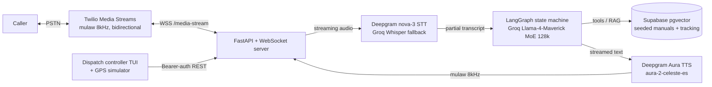

# Real-Time Voice Agent — "Última Milla" (Case Study)

> **Code is private (client/startup work).** This documents the architecture, the latency problem and
> the outcome. Role: **AI Engineer** · Domain: last-mile logistics · Status: production phone calls.

---

## TL;DR
Last-mile logistics teams lose time on repetitive phone coordination (confirming deliveries, status
updates, customer questions). I built a **real-time telephone voice agent** that holds a natural Spanish
conversation to manage parts of the delivery/customer lifecycle. The hard part wasn't the LLM — it was
making it feel **immediate**: I drove end-to-end response latency **under one second** on live calls.

## The problem
A voice bot that pauses awkwardly feels broken. Every stage — speech-to-text → reasoning → text-to-speech
— adds delay the caller *feels*. The product only works if the turn-around is fast enough that the human
doesn't notice the machine.

## Architecture

## How I made it fast (latency engineering)
- **Stream at every stage.** Deepgram STT and Aura TTS run in streaming mode: the system starts
  processing before the caller finishes and starts speaking before the full answer is generated.
- **Act on partial transcripts + VAD.** A silence-timeout VAD (default 1.5s, configurable) closes the
  turn quickly; audio is converted mulaw↔PCM in-memory (`audioop`) with no external hop.
- **Fallbacks, no dead air.** A slow tool/model call falls back gracefully so the line never goes silent;
  Twilio `clear`/`mark` events keep playback in sync and allow barge-in-style buffer control.
- **Migration for quality/latency.** Moved STT/TTS from ElevenLabs + batch Whisper to **Deepgram
  streaming (nova-3 + Aura)**, which cut perceived latency and improved Spanish naturalness.

## Stack
Python · FastAPI + WebSockets · **Twilio Media Streams** · **Deepgram** (nova-3 STT, Aura TTS) · **Groq
Llama-4-Maverick** (reasoning) · **LangGraph** (conversational state graph) · **Supabase pgvector** (RAG
over operations manuals) · `audioop` (mulaw↔PCM). Includes a dispatch TUI and a GPS telemetry simulator
to trigger and test calls.

## Results
- **Sub-second** end-to-end response latency on live calls.
- Autonomous handling of delivery-lifecycle phone tasks, cutting manual coordination time and cost.
- Signed-webhook dispatch + config-driven VAD/latency knobs for tuning per deployment.

## What I'd do next
Add true barge-in (interrupt mid-sentence), per-call evaluation (task-completion + transcript quality),
and a warm-transfer path to a human when confidence is low.
